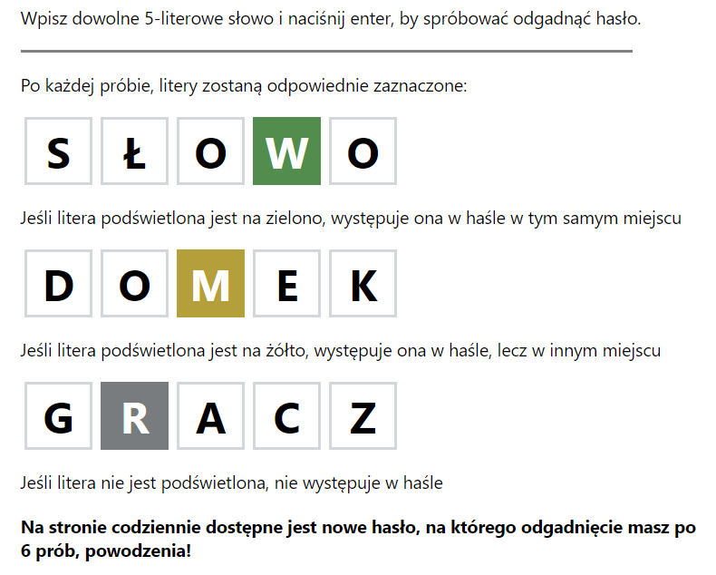
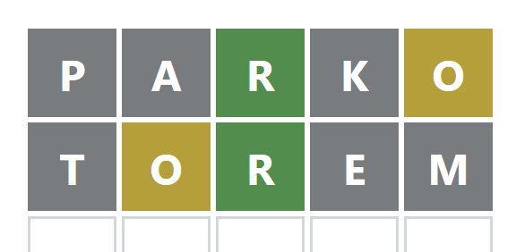
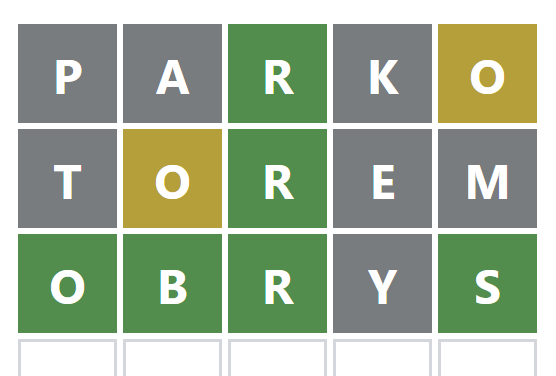
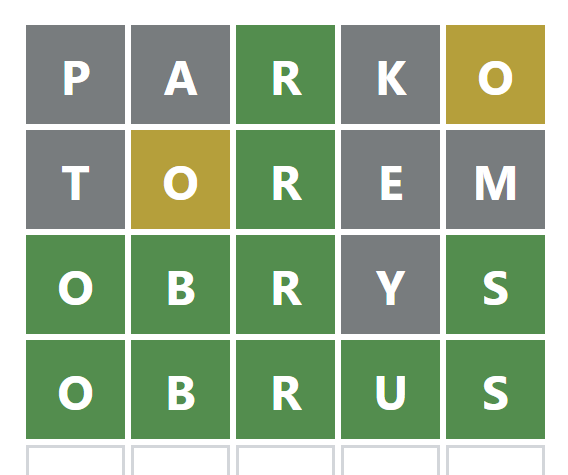

# Literalnie Solver

Literalnie solver to narzędzie pozwalające na efektywne rozwiązywanie gry przeglądarkowej Literalnie.fun w trybie dla ekspertów.

Program oblicza prawdopodobieństwo pojawienia się każdej litery na każdej z 5 pozycji w słowie, następnie wybiera słowa, które najszybciej przybliża użytkownika do wygranej, wykorzystując jak najmniejszą liczbę prób.

# Literalnie 

Literalnie to prosta gra słowna online, w której zadaniem gracza jest znalezienie pięcioliterowego słowa w sześciu próbach. Każdego dnia publikowana jest nowa zagadka.

Gra jest darmowa, dostępna na urządzenia mobilne oraz pod linkiem https://literalnie.fun/

Zasady gry: 

### Zasady gry: 


# Dane

W programie wykorzystano listę przeznaczona do gier słownych dostępną pod linkiem https://sjp.pl/sl/growy/

Licencje  [GPL 2](https://www.gnu.org/licenses/old-licenses/gpl-2.0.html),
[CC BY 4.0](https://creativecommons.org/licenses/by/4.0/),
# Przykład działania programu

### Hasło dnia: OBRUS


```python
display(f"Lista proponowanych słów na start:{
  [i[0]for i in calculate_proba(words_list)[:10]]
}")
```
Output: 
```
`"Lista proponowanych słów na start:
['parko', 'karne', 'sorka', 'sarno', 'parne',
 'warko', 'parku', 'salko', 'marko', 'parno']"
```

```python
ans_list = literalnie_solver(
  data = words_list, green = "--R--", yellow = "----o", grey = "PAK"
)
calculate_proba(ans_list)[:5]
```
Output:
```
[('torem', 1.9650793650793652),
 ('forum', 1.965079365079365),
 ('forem', 1.9619047619047618),
 ('borem', 1.9428571428571428),
 ('worem', 1.9333333333333333)]
```


```python
ans_list = literalnie_solver(data = ans_list, green = "--R--", yellow = "-o---", grey = "TEM")
calculate_proba(ans_list)[:5]
```
Output:
```
[('obrys', 2.2439024390243905),
 ('obryć', 2.1951219512195124),
 ('obryj', 2.1707317073170733),
 ('obryw', 2.1707317073170733),
 ('odryb', 2.1707317073170733)]
```


```python
ans_list = literalnie_solver(data = ans_list, green = "OBR-S", yellow = "-----", grey = "Y")
calculate_proba(ans_list)[:5]
```
Output:
```
[('obrus', 5.0)]
```

